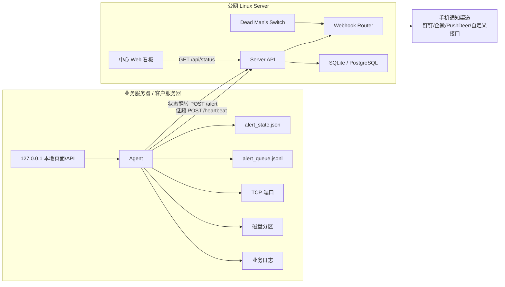

# 运维监控系统完整技术方案

## 0. 文档定位

本文档是运维监控系统的完整需求概览与技术实现方案，目标是让后续研发人员仅凭本文档即可重新设计并实现整个项目。

系统采用“边缘检测 Agent + 中心路由 Server”的非侵入式分布式架构：

- Agent 部署在多台业务服务器，负责高频本地检测、本地告警收敛、本地状态展示。
- Server 部署在公网 Linux 服务器，负责 Agent 存活判定、告警接收、告警二次转发、数据持久化。

本文档同时用于：

- 项目汇报。
- 开发排期。
- 代码重构依据。
- 部署与验收依据。
- 后续重新实现项目的规格说明。

## 1. 系统目标

### 1.1 业务目标

在多客户、多产品线、多服务器、多 Tomcat/Java 服务的环境中，提供一个轻量、低侵入、易部署的运维监控系统，帮助运维人员及时发现：

- 业务端口不可用。
- 磁盘容量不足。
- Agent 或服务器失联。
- 日志中出现异常堆栈。
- 告警是否已经推送到手机通知渠道。

### 1.2 技术目标

- Agent 本地高频检测，避免公网高频压力。
- Agent 仅在状态翻转时向公网发送告警，避免告警风暴。
- Agent 每 2 小时发送一次心跳，作为存活证明。
- Server 每分钟巡检 Agent 心跳时间，发现失联主动告警。
- Server 作为 Webhook Router，将告警转发到钉钉、企微、PushDeer 或自定义手机接口。
- Server 持久化告警、心跳与转发记录。
- 前端提供中心看板，Agent 本地提供轻量现场查看页面。
- 所有 Agent 请求必须携带共享密钥。

### 1.3 非目标

第一阶段不建设完整 Prometheus/Grafana 指标平台。

第一阶段不做复杂权限系统，但公网 Server 必须具备 token 校验、HTTPS 部署建议和最小暴露原则。

第一阶段不向公网 Server 上报全量日志流，只上报解析后的异常摘要和告警事件。

## 2. 架构概述

### 2.1 架构模式

系统采用：

```text
边缘检测 Agent + 中心路由 Server
```

Agent 负责“发现问题、状态收敛、本地展示”。

Server 负责“接收事件、判定失联、转发通知、持久化”。

### 2.2 架构图



### 2.3 核心设计原则

- 高频检测留在本地。
- 公网通信低频化、事件化。
- 告警必须状态收敛。
- Server 不阻塞 Agent 请求。
- 预警事件尽量不丢失。
- 配置驱动，不写死产品线和端口。
- 安全默认可配置，公网部署必须启用 token。

## 3. 角色与职责

### 3.1 Agent 检测端

部署位置：

- Windows 业务服务器。
- 多台客户服务器。
- 需要本机端口、磁盘、日志检测的机器。

核心职责：

- 高频本地自检。
- TCP 端口检测。
- 磁盘容量检测。
- 日志异常关键词检测。
- 本地状态机管理。
- 状态翻转时发送告警。
- 低频发送心跳。
- 请求失败本地队列重试。
- 本地轻量 Web 页面/API。
- 本地最近 500 行异常日志缓存。

### 3.2 Server 接收端

部署位置：

- 公网 Linux 服务器。
- 可被所有 Agent 访问。

核心职责：

- 接收 Agent 心跳。
- 接收 Agent 告警。
- 校验 token。
- 保存心跳和告警。
- 每分钟巡检 Agent 存活。
- 超时未上报触发失联告警。
- 将告警异步转发到手机通知渠道。
- 提供中心 Web 看板。

### 3.3 中心 Web 看板

职责：

- 展示 Agent 存活状态。
- 展示最近告警。
- 展示告警转发状态。
- 展示各客户/产品/服务器状态。
- 展示失联 Agent。
- 展示历史告警检索入口。

### 3.4 Agent 本地 Web

职责：

- 只监听 `127.0.0.1`。
- 运维人员登录服务器现场查看。
- 展示端口实时联通矩阵。
- 展示磁盘容量状态。
- 展示内存中的最近 500 行异常日志。
- 展示最近告警状态翻转记录。

## 4. Agent 核心需求

## 4.1 任务调度与频率分离

Agent 必须拆分不同任务频率，避免一个任务阻塞全部逻辑。

### 4.1.1 高频本地自检

默认频率：

```yaml
local_check_interval_seconds: 60
```

检测内容：

- TCP 端口。
- 磁盘容量。
- 可选 Java 进程关键字。
- 可选 Windows 服务。

检测结果：

- 写入内存快照。
- 写入本地状态机。
- 用于本地 Web 页面展示。
- 用于判断是否触发状态翻转告警。

### 4.1.2 低频心跳上报

默认频率：

```yaml
heartbeat_interval_seconds: 7200
```

即每 2 小时发送一次。

心跳作用：

- 证明 Agent 仍在线。
- 让 Server 更新最后上报时间。
- 给 Server 提供基础系统信息。

心跳应精简，不携带大量日志。

### 4.1.3 事件驱动上报

仅在状态翻转时立即向 Server 发送请求：

- OK -> BAD：发送告警。
- BAD -> OK：发送恢复。
- BAD -> BAD：不发公网请求。
- OK -> OK：不发公网请求。

事件驱动上报用于：

- 端口异常。
- 端口恢复。
- 磁盘低容量。
- 磁盘恢复。
- 日志异常摘要。

## 4.2 Agent 本地状态机

### 4.2.1 状态文件

建议持久化：

```text
alert_state.json
```

保存位置：

- exe 同目录。
- 或配置项指定。

配置：

```yaml
state:
  file: "alert_state.json"
  flush_interval_seconds: 5
```

### 4.2.2 状态键设计

端口状态键：

```text
port:{host}:{port}:{service_key}
```

磁盘状态键：

```text
disk:{mountpoint}
```

日志异常状态键：

```text
log:{source_id}:{fingerprint}
```

Agent 心跳状态不需要本地状态机，Server 负责失联判断。

### 4.2.3 状态值结构

```json
{
  "state": "ok",
  "last_state": "bad",
  "last_changed_at": 1710000000,
  "last_checked_at": 1710000060,
  "last_alert_sent_at": 1710000000,
  "consecutive_failures": 0,
  "consecutive_successes": 3,
  "details": {}
}
```

字段说明：

| 字段 | 说明 |
| --- | --- |
| state | 当前状态，`ok` 或 `bad` |
| last_state | 上一次状态 |
| last_changed_at | 状态最近翻转时间 |
| last_checked_at | 最近检测时间 |
| last_alert_sent_at | 最近向公网发送告警时间 |
| consecutive_failures | 连续失败次数 |
| consecutive_successes | 连续成功次数 |
| details | 当前检测详情 |

### 4.2.4 告警触发规则

| 状态变化 | 动作 |
| --- | --- |
| OK -> BAD | 立即发送 error/open 告警 |
| BAD -> OK | 立即发送 resolved 恢复 |
| BAD -> BAD | 只更新本地状态，不发送 |
| OK -> OK | 静默 |

### 4.2.5 防抖设计

可配置连续失败阈值，避免网络瞬断误报：

```yaml
alerts:
  port_down_consecutive_failures: 1
  disk_low_consecutive_failures: 1
```

第一阶段可以默认 1，即立即触发。

## 4.3 端口检测

### 4.3.1 配置格式

```yaml
port_checks:
  - id: runner-api
    host: "127.0.0.1"
    port: 9176
    name: "bus-runner"
    service_key: "bus-runner"
    product_line: "Runner"
    timeout_seconds: 0.6
```

兼容旧格式：

```yaml
port_checks:
  - 9176
  - 9173
```

### 4.3.2 检测实现

- 使用 TCP socket。
- 默认检查 `127.0.0.1:port`。
- 超时时间可全局配置，也可单项覆盖。
- 结果写入本地快照。

端口检测结果：

```json
{
  "id": "runner-api",
  "host": "127.0.0.1",
  "port": 9176,
  "ok": false,
  "name": "bus-runner",
  "service_key": "bus-runner",
  "product_line": "Runner",
  "checked_at": 1710000000,
  "error": "connection refused"
}
```

## 4.4 磁盘容量检测

### 4.4.1 需求

任意一块硬盘空闲容量低于 10% 时预警。

### 4.4.2 配置

```yaml
disk_checks:
  enabled: true
  free_threshold_percent: 10
  include_mounts: []
  exclude_mounts: []
```

说明：

- `include_mounts` 为空时检查所有本地固定磁盘。
- `exclude_mounts` 用于排除临时盘、光驱、网络盘。

### 4.4.3 检测结果

```json
{
  "device": "C:\\",
  "mountpoint": "C:\\",
  "fstype": "NTFS",
  "total_gb": 200.0,
  "free_gb": 15.2,
  "used_percent": 92.4,
  "free_percent": 7.6,
  "ok": false
}
```

## 4.5 日志异常检测

### 4.5.1 设计调整

公网 Server 不再接收全量日志流。

Agent 仅做：

- 本地 tail。
- 本地缓冲最近异常日志。
- 异常关键词触发。
- 抽取 Error Stack 摘要。
- 状态翻转或新异常摘要时发送告警事件。

### 4.5.2 本地缓冲

Agent 内存维护：

```text
recent_error_logs: deque(maxlen=500)
```

本地 Web 页面展示最近 500 行或 500 条异常摘要。

### 4.5.3 异常识别配置

```yaml
log_sources:
  - id: runner-tomcat-logs
    name: Runner Tomcat 日志
    service_key: apache-tomcat-runner
    product_line: Runner
    path: C:/seentao/dbe/backend/common/tomcats/runner/apache-tomcat-runner/logs
    globs:
      - "*.log"
      - "catalina.*.log"

error_keywords:
  - "ERROR"
  - "Exception"
  - "SEVERE"
  - "ORA-"
  - "SQLException"
  - "OutOfMemoryError"
  - "Caused by"
```

### 4.5.4 Error Stack 摘要

发送到 Server 的不是全量日志，而是摘要：

```json
{
  "type": "log_error",
  "status": "error",
  "hostname": "Win-Runner-01",
  "source_id": "runner-tomcat-logs",
  "service_key": "apache-tomcat-runner",
  "log_file": "catalina.2026-05-15.log",
  "fingerprint": "sha256...",
  "summary": "java.sql.SQLException: ...",
  "stack_excerpt": "最多 N 行异常片段",
  "observed_at": 1710000000
}
```

### 4.5.5 日志 offset 持久化

配置：

```yaml
tail_resume:
  enabled: true
  offset_file: "tail_offsets.json"
  new_file_without_state: "end"
```

建议：

- 生产环境默认从文件尾开始，避免首次启动扫描大量历史日志。
- 若需要补扫历史，可配置 `beginning`。

## 4.6 本地运维辅助 Web

### 4.6.1 监听限制

Agent 本地 Web 仅监听：

```text
127.0.0.1
```

默认端口：

```yaml
local_web:
  enabled: true
  host: "127.0.0.1"
  port: 17680
```

不允许默认监听 `0.0.0.0`，避免暴露到业务网络。

### 4.6.2 本地 API

#### GET `/`

返回本地 HTML 页面。

#### GET `/api/local/status`

返回：

```json
{
  "hostname": "Win-Runner-01",
  "last_check_at": 1710000000,
  "ports": [],
  "disks": [],
  "recent_errors": [],
  "alert_state": {}
}
```

### 4.6.3 本地页面功能

- 端口实时联通矩阵。
- 磁盘容量列表。
- 最近 500 行异常日志。
- 最近状态翻转记录。
- 告警队列长度。
- 最近一次心跳时间。

## 4.7 Agent 心跳

### 4.7.1 心跳频率

默认：

```yaml
heartbeat_interval_seconds: 7200
```

即每 2 小时。

### 4.7.2 心跳接口

```http
POST /heartbeat
Auth-Token: shared-secret
Content-Type: application/json
```

### 4.7.3 心跳 payload

```json
{
  "hostname": "Win-Runner-01",
  "server_ip": "192.168.1.20",
  "customer_id": "customer-a",
  "customer": "客户A",
  "product": "Runner",
  "agent_version": "1.0.0",
  "observed_at": 1710000000,
  "system": {
    "os": "Windows Server",
    "cpu_percent": 20.5,
    "memory_percent": 55.1,
    "disk_summary": [
      {
        "mountpoint": "C:\\",
        "free_percent": 23.5
      }
    ]
  },
  "summary": {
    "port_total": 29,
    "port_bad": 0,
    "disk_total": 2,
    "disk_bad": 0,
    "queue_size": 0
  }
}
```

### 4.7.4 心跳失败

心跳失败不立即告警，因为 Server 会通过 Dead Man's Switch 判断失联。

Agent 可记录本地失败次数，供本地页面展示。

## 4.8 Agent 告警请求

### 4.8.1 接口

```http
POST /alert
Auth-Token: shared-secret
Content-Type: application/json
```

### 4.8.2 告警格式

最小必填字段：

```json
{
  "hostname": "Win-Runner-01",
  "type": "port",
  "status": "error",
  "observed_at": 1710000000
}
```

完整格式：

```json
{
  "event_id": "Win-Runner-01-port-9176-error-1710000000",
  "hostname": "Win-Runner-01",
  "server_ip": "192.168.1.20",
  "customer_id": "customer-a",
  "customer": "客户A",
  "product": "Runner",
  "type": "port",
  "status": "error",
  "severity": "critical",
  "service_key": "bus-runner",
  "service_name": "Runner 执行服务",
  "port": 9176,
  "message": "端口不可用: bus-runner 127.0.0.1:9176",
  "observed_at": 1710000000,
  "details": {
    "host": "127.0.0.1",
    "port": 9176,
    "ok": false
  }
}
```

### 4.8.3 type 枚举

| type | 说明 |
| --- | --- |
| port | 端口异常或恢复 |
| disk | 磁盘容量异常或恢复 |
| log | 日志异常摘要 |
| offline | Server 生成的离线告警 |
| agent | Agent 自身异常 |

### 4.8.4 status 枚举

| status | 说明 |
| --- | --- |
| error | 异常打开 |
| resolved | 异常恢复 |
| info | 信息事件 |

### 4.8.5 severity 枚举

| severity | 说明 |
| --- | --- |
| critical | 影响业务可用性 |
| warning | 有风险但未必立即中断 |
| info | 恢复或普通信息 |

## 4.9 Agent 请求失败队列

### 4.9.1 队列文件

```yaml
alerts:
  queue_file: "alert_queue.jsonl"
  max_queue_entries: 1000
  retry_interval_seconds: 30
```

### 4.9.2 队列规则

- `/alert` 失败时写入队列。
- 心跳失败不强制入队，可只记录本地状态。
- 队列按 JSONL 存储。
- 成功重发后删除对应事件。
- 超过上限保留最新事件。

### 4.9.3 失败判定

以下情况视为失败：

- 网络异常。
- 请求超时。
- 5xx。
- 429。

以下情况默认不进入无限重试：

- 401 token 错误。
- 400 payload 格式错误。

原因：这类错误通常需要人工修配置。

## 5. Server 核心需求

## 5.1 Server 定位

Server 是公网中心路由，不承担高频探测。

职责：

- 接收 Agent 心跳。
- 接收 Agent 告警。
- 判断 Agent 是否失联。
- 异步转发手机通知。
- 持久化心跳、告警、转发记录。
- 提供中心 Web 看板 API。

## 5.2 Server 配置

```yaml
host: "0.0.0.0"
port: 5000
auth_token: "replace-with-long-secret"

database:
  enabled: true
  type: "sqlite"
  path: "ops_monitor.db"

deadman:
  enabled: true
  check_interval_seconds: 60
  default_timeout_seconds: 750

webhooks:
  enabled: true
  timeout_seconds: 8
  workers: 4
  routes:
    - name: "dingtalk-default"
      enabled: true
      match:
        customer: "*"
        product: "*"
        severity: ["critical", "warning"]
      request:
        method: "POST"
        url: "https://oapi.dingtalk.com/robot/send?access_token=xxx"
        headers:
          Content-Type: "application/json"
        body_template: |
          {
            "msgtype": "text",
            "text": {
              "content": "[{{severity}}] {{hostname}} {{message}}"
            }
          }

agents:
  - hostname: "Win-Runner-01"
    customer: "客户A"
    product: "Runner"
    server_ip: "192.168.1.20"
    timeout_seconds: 750
```

## 5.3 认证与鉴权

所有 Agent 请求必须带共享密钥：

```http
Auth-Token: shared-secret
```

兼容可选：

```http
X-Ops-Token: shared-secret
```

Server 拦截：

- `/heartbeat`
- `/alert`
- 兼容旧接口 `/report`

失败返回：

```json
{
  "status": "error",
  "message": "unauthorized"
}
```

HTTP 状态码：

```text
401
```

## 5.4 `/heartbeat` 接口

### 5.4.1 请求

```http
POST /heartbeat
Auth-Token: shared-secret
Content-Type: application/json
```

### 5.4.2 功能

- 解析 Agent 心跳。
- 更新 Agent 最后上报时间。
- 保存基础系统信息。
- 写入数据库。
- 若 Agent 此前处于 offline 状态，生成恢复事件并可转发通知。

### 5.4.3 响应

```json
{
  "status": "ok",
  "server_time": 1710000000
}
```

## 5.5 `/alert` 接口

### 5.5.1 请求

```http
POST /alert
Auth-Token: shared-secret
Content-Type: application/json
```

### 5.5.2 功能

- 校验 payload。
- 写入告警表。
- 更新 Agent 最后上报时间。
- 投递到异步 webhook 队列。
- 立即返回，避免阻塞 Agent。

### 5.5.3 响应

```json
{
  "status": "ok",
  "event_id": "..."
}
```

## 5.6 Dead Man's Switch 失联检测

### 5.6.1 机制

Server 后台线程每分钟检查所有受控 Agent：

```yaml
deadman:
  check_interval_seconds: 60
  default_timeout_seconds: 750
```

默认 750 秒，即 2 小时 5 分钟。

### 5.6.2 判断规则

- 从未收到心跳：`missing`
- 最后心跳超过 timeout：`offline`
- 正常：`online`

### 5.6.3 告警规则

- online -> offline：生成 `type=offline,status=error`
- offline -> online：生成 `type=offline,status=resolved`
- offline -> offline：不重复推送
- missing 可选择是否启动后立即告警，建议延迟一个 timeout 周期

### 5.6.4 离线告警 payload

```json
{
  "type": "offline",
  "status": "error",
  "severity": "critical",
  "hostname": "Win-Runner-01",
  "customer": "客户A",
  "product": "Runner",
  "message": "Agent 超过 750 秒未上报心跳",
  "observed_at": 1710000000
}
```

## 5.7 Webhook Router

### 5.7.1 目标

Server 接收到 Agent 告警后，根据配置构造自定义 POST 请求，转发到手机通知接口。

支持渠道：

- 钉钉机器人。
- 企业微信机器人。
- PushDeer。
- 自定义 HTTP 接口。

### 5.7.2 动态模板

模板变量：

| 变量 | 说明 |
| --- | --- |
| hostname | 主机名 |
| type | 告警类型 |
| status | 告警状态 |
| severity | 严重级别 |
| message | 告警正文 |
| customer | 客户 |
| product | 产品 |
| server_ip | 服务器 IP |
| service_key | 服务 |
| port | 端口 |
| observed_at | 发生时间 |

模板示例：

```json
{
  "msgtype": "text",
  "text": {
    "content": "[{{severity}}] {{customer}}/{{product}} {{hostname}} {{message}}"
  }
}
```

### 5.7.3 路由匹配

可按以下字段匹配：

- customer
- product
- hostname
- type
- status
- severity
- service_key

示例：

```yaml
match:
  customer: "客户A"
  product: "Runner"
  severity: ["critical", "warning"]
```

### 5.7.4 异步处理

要求：

- `/alert` 接口不能等待第三方 webhook 慢响应。
- Server 收到告警后写 DB，然后放入转发队列。
- 后台 worker 执行 webhook。
- 记录每次转发结果。

实现方式：

第一阶段：

- `queue.Queue`
- 多个 worker 线程
- `requests.post(timeout=8)`

后续：

- asyncio + httpx
- Celery/RQ
- Redis 队列

### 5.7.5 转发失败处理

配置：

```yaml
webhooks:
  retry:
    max_attempts: 3
    backoff_seconds: 30
```

策略：

- 失败后重试。
- 超过次数标记 `failed`。
- 写入 `webhook_deliveries` 表。
- 前端展示失败状态。

## 6. 数据库设计

## 6.1 选型

第一阶段：

- SQLite

原因：

- 单文件。
- 无额外服务。
- Python 标准库支持。
- 适合轻量部署。

第二阶段：

- PostgreSQL

适用：

- 多客户规模扩大。
- 需要多用户和复杂查询。
- 需要更强并发和备份能力。

## 6.2 agents 表

保存受控 Agent 与最后心跳状态。

```sql
CREATE TABLE agents (
  id INTEGER PRIMARY KEY AUTOINCREMENT,
  hostname TEXT NOT NULL UNIQUE,
  customer TEXT,
  product TEXT,
  server_ip TEXT,
  expected INTEGER NOT NULL DEFAULT 1,
  status TEXT NOT NULL DEFAULT 'unknown',
  timeout_seconds INTEGER NOT NULL DEFAULT 750,
  last_heartbeat_at INTEGER,
  last_payload_json TEXT,
  created_at INTEGER NOT NULL,
  updated_at INTEGER NOT NULL
);
```

## 6.3 heartbeats 表

保存心跳历史。

```sql
CREATE TABLE heartbeats (
  id INTEGER PRIMARY KEY AUTOINCREMENT,
  hostname TEXT NOT NULL,
  customer TEXT,
  product TEXT,
  server_ip TEXT,
  observed_at INTEGER,
  received_at INTEGER NOT NULL,
  payload_json TEXT NOT NULL
);
```

索引：

```sql
CREATE INDEX idx_heartbeats_hostname_time ON heartbeats(hostname, received_at);
```

## 6.4 alerts 表

保存 Agent 告警和 Server 生成的离线告警。

```sql
CREATE TABLE alerts (
  id INTEGER PRIMARY KEY AUTOINCREMENT,
  event_id TEXT,
  hostname TEXT NOT NULL,
  customer TEXT,
  product TEXT,
  server_ip TEXT,
  type TEXT NOT NULL,
  status TEXT NOT NULL,
  severity TEXT NOT NULL,
  service_key TEXT,
  service_name TEXT,
  port INTEGER,
  disk_mount TEXT,
  message TEXT,
  observed_at INTEGER,
  received_at INTEGER NOT NULL,
  payload_json TEXT NOT NULL
);
```

索引：

```sql
CREATE INDEX idx_alerts_hostname_time ON alerts(hostname, received_at);
CREATE INDEX idx_alerts_type_status ON alerts(type, status);
CREATE INDEX idx_alerts_event_id ON alerts(event_id);
```

## 6.5 webhook_deliveries 表

保存告警转发记录。

```sql
CREATE TABLE webhook_deliveries (
  id INTEGER PRIMARY KEY AUTOINCREMENT,
  alert_id INTEGER,
  event_id TEXT,
  route_name TEXT NOT NULL,
  target_url TEXT NOT NULL,
  status TEXT NOT NULL,
  attempts INTEGER NOT NULL DEFAULT 0,
  last_error TEXT,
  request_json TEXT,
  response_status INTEGER,
  response_text TEXT,
  created_at INTEGER NOT NULL,
  updated_at INTEGER NOT NULL
);
```

状态：

- pending
- success
- failed
- skipped

## 6.6 retention 策略

配置：

```yaml
retention:
  heartbeats_days: 30
  alerts_days: 180
  deliveries_days: 180
```

可由 Server 后台任务每日清理。

第一阶段可以先不实现自动清理，但数据库结构和配置应预留。

## 7. Server API 设计

## 7.1 通用响应

成功：

```json
{
  "status": "ok"
}
```

失败：

```json
{
  "status": "error",
  "message": "unauthorized"
}
```

## 7.2 POST `/heartbeat`

用途：

- Agent 低频存活证明。

必填：

- hostname
- observed_at

响应：

```json
{
  "status": "ok",
  "server_time": 1710000000
}
```

## 7.3 POST `/alert`

用途：

- Agent 状态翻转告警。
- Agent 恢复通知。
- Agent 日志异常摘要。

必填：

- hostname
- type
- status
- observed_at

Server 行为：

- 校验 token。
- 写入 alerts。
- 入 webhook 队列。
- 立即返回。

## 7.4 GET `/api/status`

用途：

- 中心 Web 看板轮询。

返回：

```json
{
  "agents": [],
  "alerts": [],
  "webhook_deliveries": [],
  "stats": {}
}
```

## 7.5 GET `/api/alerts`

二期接口。

支持查询参数：

- hostname
- customer
- product
- type
- status
- severity
- start
- end
- page
- page_size

## 8. 前端设计

## 8.1 中心看板

展示模块：

- 总 Agent 数。
- 在线 Agent 数。
- 离线 Agent 数。
- 最近告警数。
- Webhook 转发失败数。
- Agent 列表。
- 最近告警列表。
- 离线/失联列表。
- 告警趋势。

## 8.2 Agent 本地页面

展示模块：

- 本机端口矩阵。
- 本机磁盘状态。
- 最近 500 行异常日志。
- 告警状态机快照。
- 告警队列长度。
- 最近心跳时间。
- 最近公网请求失败原因。

## 9. 安全设计

## 9.1 Token

所有 Agent 请求必须携带：

```http
Auth-Token: shared-secret
```

Server 必须校验。

可兼容：

```http
X-Ops-Token: shared-secret
```

## 9.2 HTTPS

公网 Server 必须通过 HTTPS 暴露。

推荐：

- Nginx + Let's Encrypt
- Caddy 自动证书

## 9.3 IP 限制

可选：

- Nginx 白名单。
- 云防火墙限制来源 IP。

## 9.4 防重放二期方案

Header 增加：

```http
Auth-Timestamp: 1710000000
Auth-Nonce: uuid
Auth-Signature: hmac-sha256
```

签名内容：

```text
method + path + timestamp + nonce + body_sha256
```

## 10. 配置文件完整示例

## 10.1 Agent config.yaml

```yaml
server_url: "https://monitor.example.com"
hostname: "Win-Runner-01"

customer:
  id: "customer-a"
  name: "客户A"

agent:
  version: "1.0.0"

scheduler:
  local_check_interval_seconds: 60
  heartbeat_interval_seconds: 7200

auth:
  token: "replace-with-long-secret"

local_web:
  enabled: true
  host: "127.0.0.1"
  port: 17680
  recent_error_limit: 500

state:
  file: "alert_state.json"
  flush_interval_seconds: 5

alerts:
  endpoint: "https://monitor.example.com/alert"
  queue_file: "alert_queue.jsonl"
  max_queue_entries: 1000
  retry_interval_seconds: 30
  port_down_consecutive_failures: 1
  disk_low_consecutive_failures: 1

heartbeat:
  endpoint: "https://monitor.example.com/heartbeat"

disk_checks:
  enabled: true
  free_threshold_percent: 10
  include_mounts: []
  exclude_mounts: []

service_catalog:
  - service_key: "bus-runner"
    name: "Runner 执行服务"
    product_line: "Runner"

port_checks:
  - id: "runner-api"
    host: "127.0.0.1"
    port: 9176
    name: "bus-runner"
    service_key: "bus-runner"
    product_line: "Runner"

log_sources:
  - id: "runner-tomcat-logs"
    name: "Runner Tomcat 日志"
    service_key: "apache-tomcat-runner"
    product_line: "Runner"
    path: "C:/seentao/dbe/backend/common/tomcats/runner/apache-tomcat-runner/logs"
    globs:
      - "*.log"
      - "catalina.*.log"

tail_resume:
  enabled: true
  offset_file: "tail_offsets.json"
  new_file_without_state: "end"

error_keywords:
  - "ERROR"
  - "Exception"
  - "SEVERE"
  - "ORA-"
  - "SQLException"
  - "OutOfMemoryError"
  - "Caused by"
```

## 10.2 Server server_config.yaml

```yaml
host: "0.0.0.0"
port: 5000
auth_token: "replace-with-long-secret"

database:
  enabled: true
  type: "sqlite"
  path: "ops_monitor.db"

deadman:
  enabled: true
  check_interval_seconds: 60
  default_timeout_seconds: 750

agents:
  - hostname: "Win-Runner-01"
    customer: "客户A"
    product: "Runner"
    server_ip: "192.168.1.20"
    timeout_seconds: 750

webhooks:
  enabled: true
  timeout_seconds: 8
  workers: 4
  retry:
    max_attempts: 3
    backoff_seconds: 30
  routes:
    - name: "default-push"
      enabled: true
      match:
        customer: "*"
        product: "*"
        severity:
          - "critical"
          - "warning"
      request:
        method: "POST"
        url: "https://example.com/mobile-push"
        headers:
          Content-Type: "application/json"
        body_template: |
          {
            "title": "{{severity}} {{type}}",
            "content": "{{customer}} {{product}} {{hostname}} {{message}}"
          }
```

## 11. 代码模块设计

## 11.1 Agent 模块

建议拆分：

```text
agent/
  agent.py              # 主入口
  config.py             # 配置加载
  scheduler.py          # 调度器
  checkers.py           # 端口/磁盘/进程检测
  alert_state.py        # 状态机持久化
  alert_sender.py       # 告警发送与队列
  heartbeat.py          # 心跳
  log_watcher.py        # 日志 tail 与异常摘要
  local_web.py          # 本地 127.0.0.1 页面/API
  state_store.py        # offset 与去重
```

## 11.2 Server 模块

建议拆分：

```text
server/
  app.py                # Flask app 创建
  config.py             # 配置加载
  auth.py               # token 校验
  db.py                 # 数据库
  routes.py             # API 路由
  deadman.py            # 失联检测线程
  webhook_router.py     # Webhook 路由与模板
  webhook_worker.py     # 异步转发 worker
  templates/
    index.html
```

## 12. 异步与并发设计

### 12.1 Agent

建议线程：

- local_check_loop：每 60 秒。
- heartbeat_loop：每 2 小时。
- alert_queue_flush_loop：每 30 秒。
- log_tail_threads：每个日志文件或目录扫描。
- local_web_thread：本地页面。

### 12.2 Server

建议线程：

- Web 主线程。
- Dead Man's Switch 巡检线程。
- Webhook worker 线程池。
- 可选 DB retention 清理线程。

### 12.3 Server 接口不阻塞

`POST /alert` 必须：

1. 校验 token。
2. 写 DB 或内存。
3. 投递队列。
4. 立即返回。

不能同步等待第三方手机接口。

## 13. 部署方案

### 13.1 Agent Windows 部署

文件：

```text
ops-agent.exe
config.yaml
```

启动：

```bat
ops-agent.exe --config config.yaml
```

推荐服务化：

- Windows 计划任务。
- NSSM。
- Windows Service Wrapper。

### 13.2 Server Linux 部署

推荐：

- Python venv。
- Waitress/Gunicorn。
- systemd。
- Nginx/Caddy HTTPS 反代。

systemd 示例：

```ini
[Unit]
Description=Ops Monitor Server
After=network.target

[Service]
WorkingDirectory=/opt/ops-monitor
Environment=OPS_SERVER_CONFIG=/opt/ops-monitor/server_config.yaml
ExecStart=/opt/ops-monitor/.venv/bin/python server/app.py
Restart=always
RestartSec=5

[Install]
WantedBy=multi-user.target
```

## 14. 打包方案

### 14.1 Agent exe

```bat
pyinstaller ^
  --clean ^
  --noconfirm ^
  --onefile ^
  --name ops-agent ^
  --paths F:\py_agent\agent ^
  --hidden-import state_store ^
  agent\agent.py
```

### 14.2 Server exe

```bat
pyinstaller ^
  --clean ^
  --noconfirm ^
  --onefile ^
  --name ops-server ^
  --paths F:\py_agent ^
  --add-data "server\templates;templates" ^
  --hidden-import waitress ^
  server\app.py
```

### 14.3 一体化 exe

适合单机测试，不是公网正式推荐形态。

```bat
pyinstaller ^
  --clean ^
  --noconfirm ^
  --onefile ^
  --name ops-all ^
  --paths F:\py_agent ^
  --paths F:\py_agent\agent ^
  --add-data "server\templates;templates" ^
  --hidden-import state_store ^
  --hidden-import waitress ^
  ops_all.py
```

## 15. 测试与验收

## 15.1 Agent 验收

- 每 60 秒完成端口和磁盘检测。
- 每 2 小时发送心跳。
- OK -> BAD 立即发送告警。
- BAD -> OK 立即发送恢复。
- BAD -> BAD 不重复发送。
- OK -> OK 静默。
- `alert_state.json` 重启后仍生效。
- Server 不可达时告警写入本地队列。
- Server 恢复后队列补发。
- 本地页面只允许 127.0.0.1 访问。
- 本地页面显示最近 500 行异常日志。

## 15.2 Server 验收

- `/heartbeat` 可接收并保存心跳。
- `/alert` 可接收并保存告警。
- token 错误返回 401。
- 每分钟巡检 Agent。
- 超过 2 小时 5 分钟未心跳触发 offline 告警。
- 告警转发到手机接口不阻塞 `/alert` 响应。
- Webhook 成功/失败有记录。
- 中心页面可展示 Agent 状态和告警。

## 15.3 端到端验收

1. 启动 Server。
2. 启动 Agent。
3. 确认 Server 收到心跳。
4. 关闭某个被监控端口。
5. 确认 Agent 立即发送 port error。
6. 确认手机接口收到通知。
7. 恢复端口。
8. 确认 Agent 发送 port resolved。
9. 停止 Agent。
10. 等待 2 小时 5 分钟。
11. 确认 Server 触发 offline 告警。

## 16. 迭代路线

### 16.1 第一阶段：核心闭环

- Agent 高频本地检测。
- Agent 状态机。
- Agent 心跳。
- Agent 告警状态翻转。
- Agent 本地页面。
- Server `/heartbeat`。
- Server `/alert`。
- Server Dead Man's Switch。
- Server Webhook Router。
- SQLite 持久化。

### 16.2 第二阶段：运维体验

- 告警确认。
- 告警关闭。
- 告警备注。
- 前端历史查询。
- Webhook 转发失败重试页面。
- 数据库保留策略。

### 16.3 第三阶段：安全与平台化

- 用户登录。
- 多客户权限。
- Token 分客户。
- HMAC 签名。
- PostgreSQL。
- Agent 配置下发。

### 16.4 第四阶段：规模化

- Server 多实例。
- Redis 队列。
- 消息队列。
- Prometheus 指标导出。
- 自动升级 Agent。

## 17. 风险与对策

| 风险 | 影响 | 对策 |
| --- | --- | --- |
| Agent 高频上报公网 | Server 压力大 | 高频检测本地化，公网仅心跳和事件 |
| 告警风暴 | 手机通知刷屏 | 本地状态机，状态翻转才发 |
| Server 第三方 webhook 慢 | 阻塞 Agent 请求 | 异步队列和 worker |
| Agent 断网 | 告警丢失 | 本地 JSONL 队列 |
| Agent 重启 | 重复告警 | alert_state.json 持久化 |
| 公网接口暴露 | 安全风险 | Auth-Token、HTTPS、IP 白名单 |
| 全量日志上公网 | 流量和隐私风险 | 仅上报异常摘要 |
| SQLite 容量增长 | 磁盘风险 | retention 策略，后续 PostgreSQL |

## 18. 最小可复刻实现清单

如果未来只根据本文档重新实现，需要完成：

Agent：

- 配置加载。
- 高频本地检测调度器。
- TCP 端口检测。
- 磁盘检测。
- 状态机持久化 `alert_state.json`。
- 告警事件构造。
- 告警发送和失败队列。
- 心跳发送。
- 日志 tail、异常关键词识别、最近 500 行本地缓存。
- 本地 Web 页面/API。

Server：

- 配置加载。
- token 中间件。
- `/heartbeat`。
- `/alert`。
- Dead Man's Switch 后台线程。
- Webhook Router。
- Webhook Worker。
- SQLite 表初始化与写入。
- `/api/status`。
- 中心 Web 看板。

部署：

- Windows Agent exe。
- Linux Server systemd。
- HTTPS 反代。
- 打包命令。

## 19. 汇报摘要

本系统采用边缘检测 Agent 与公网中心 Server 的分布式架构。Agent 在业务服务器本地每 60 秒检测端口和磁盘，每 2 小时发送一次心跳，仅在状态发生 OK/BAD 翻转时向公网 Server 发送告警或恢复事件，从源头避免告警风暴和公网高频压力。Server 负责接收心跳和告警，定时执行 Dead Man's Switch 判断 Agent 是否失联，并通过异步 Webhook Router 将告警转发到钉钉、企微、PushDeer 或自定义手机接口。系统支持 token 鉴权、SQLite 持久化、本地告警状态机、失败队列重试、本地运维页面和中心看板，适合多客户、多产品线、多服务器的轻量级运维监控场景。
